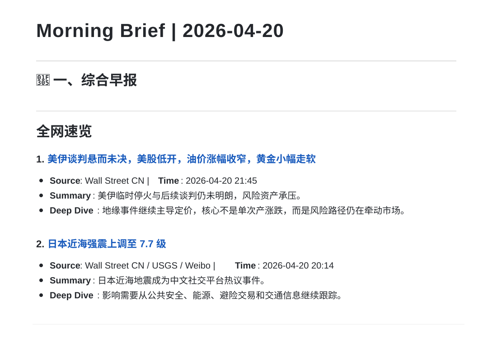

# 不刷信息流，也能跟上今天

一句话安装：

```text
帮我安装这个 skill：https://github.com/vinsonhi/AI-Skills/tree/main/skills/self-daily-briefing-skill
```

如果你的 AI Agent 支持从 GitHub 路径安装 skill，直接使用上面这句即可。

如果不支持自动安装，可以下载本目录，并放到你的 Agent 指定的 skills 目录；安装后刷新或重启 Agent，让它重新索引 skills。

一个给 AI Agent 使用的中文 Morning Brief skill，把综合新闻、财经市场、AI 行业动态和美股观察名单整理成一份飞书日报。

## 你会得到什么

默认生成一份“标准日报”，包含：

- 综合早报：科技、创投、社交和市场热点
- 财经早报：宏观、市场、板块、加密和关键驱动
- AI 日报：论文、AI builders、播客、官方博客、newsletter，以及对 AI 产品/开发者/创业有实质影响的科技动态
- 美股股票早报：自选股价格、涨跌原因、重要新闻和一句话判断

默认会在你的飞书空间创建一篇飞书文档，并把文档链接发给你；可自选 PDF 或 Markdown 文件。



## 快速开始

1. 在你的 AI Agent 中安装这个 skill。
2. 对 Agent 说 `牛马牛马`，或直接说“帮我生成今天的日报”。
3. 第一次使用时，Agent 会用对话方式带你完成设置。

第一次设置会问你：

- 日报语言：中文、英文或双语
- 美股观察名单：不填则默认跟踪 Mag 7
- 额外关注的信息：公司、产品、人物或主题
- 是否现在先跑一版看看效果

设置完成后，以后再生成日报不会重复问。想改设置时，直接告诉 Agent：

```text
重新设置日报偏好
把我的美股观察名单改成 NVDA、AMD、MSFT、META
以后多关注 AI 搜索和机器人
```

## 怎么使用

打开菜单：

```text
牛马牛马
```

直接生成：

```text
帮我生成今天的标准日报
帮我生成今天的 AI 日报
帮我生成美股股票早报
帮我生成 NVDA、AMD、MSFT、GOOGL 的美股股票早报
```

如果你没有指定类型，默认生成标准日报。

## 默认信息源

### 综合 / 财经 / AI

Hacker News、GitHub Trending、Product Hunt、36Kr、微博、华尔街见闻、腾讯新闻、V2EX。

默认只收最近 24 小时内的新事件，或今天有明确新进展的延续事件。

AI 日报会吸收原科技早报里真正影响 AI 产品、开发者工具、模型基础设施和 AI 创业的内容；泛科技和普通创业资讯不再单独成板块。

- Hugging Face Papers
- 固定 AI builders on X/Twitter，覆盖 25 位研究员、创始人、产品经理和工程师
- 6 档 AI 播客：Latent Space、Training Data、No Priors、Unsupervised Learning、The MAD Podcast with Matt Turck、AI & I by Every
- AI 公司官方博客：OpenAI Blog、Anthropic Engineering、Anthropic News、Claude Blog、Google AI Blog、Meta AI Blog
- ChinAI、Ben's Bites、One Useful Thing、Memia、Interconnects

### 美股

默认观察名单是 Mag 7：

```text
AAPL, MSFT, NVDA, AMZN, GOOGL, META, TSLA
```

你可以在第一次设置时换成自己的名单，也可以之后随时通过对话修改。

## 输出

默认直接创建飞书文档。飞书文档正文结构像这样：

```text
Morning Brief | 2026-04-21

## 🌅 一、综合早报
...

## 💰 二、财经早报
...

## 🧠 三、AI 日报
...
```

标准日报会按这个顺序组织：

1. 综合早报
2. 财经早报
3. AI 日报
4. 美股股票早报

如果你只点某个模块，也会创建对应模块的飞书文档。需要额外文件时，可以明确说：

```text
额外导出成 PDF
额外保存一份 Markdown
```

## 质量规则

- 不编造新闻，不拿旧闻冒充今天的新进展。
- 信息不足时直接写缺口。
- 最近 3 天写过的同类头条，如果今天没有实质新进展，不重复放进前列。
- 标准日报发布前做板块间去重；同一事件优先保留在综合早报，财经/AI 只保留明确不同的专业增量。
- X/Twitter 内容必须来自固定账号列表；拿不到固定账号内容时明确写缺口，不用匿名搜索冒充。
- 美股价格必须来自同一轮行情快照，不能混用不同时间点或不同来源。

## 示例

参考：

- `examples/merged_daily_report_2026-03-11.md`
- `examples/merged_daily_report_2026-03-11.pdf`
